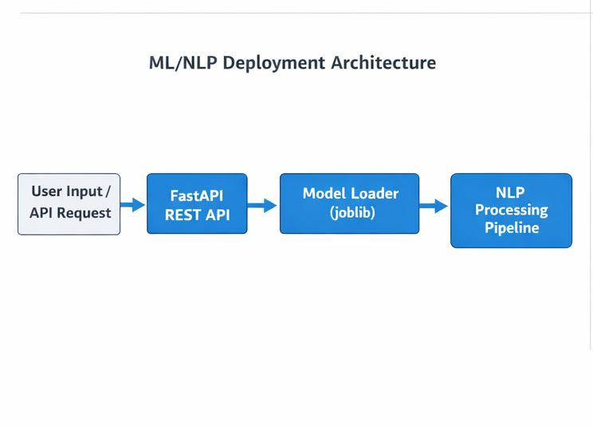

 # Full ML/NLP Deployment Demo

## Overview
Deployment of the NLP baseline as a FastAPI REST API service, demonstrating system integration and applied engineering skills. Complements the research baseline for MSc-level evaluation.

## Architecture


**Description:**  
- User text input → FastAPI → Model Loader → ML Pipeline → API Response  

## Experimental / Methodology Setup
- Pre-trained TF-IDF + Logistic Regression model loaded via `joblib`  
- REST API endpoints: `/predict` and `/health`  
- Minimal unit tests included for reproducibility  

## Outcomes
- Highlights deployment, integration, and applied engineering  
- Complements baseline project for end-to-end research and application demonstration  

## Literature / Research Context
- Demonstrates practical implementation of reproducible ML pipelines  
- Shows applied engineering skills aligned with intelligent systems research  

## PDF Summary
A concise 1-page summary is included:  
[FullMLNLPDemo.pdf](FullMLNLPDemo.pdf)

## Future Work
- Extend to interactive dashboards  
- Integrate with neural or transformer-based models  
- Automated endpoint testing and performance evaluation  

## Installation / Usage
```bash
# Start FastAPI server
uvicorn app:app --reload

# Health check
curl http://127.0.0.1:8000/health

# Prediction
curl -X POST http://127.0.0.1:8000/predict -H "Content-Type: application/json" -d '{"text": "Example text"}'

## Evaluation & Validation
The system logic is validated using lightweight unit tests to ensure correctness
of core behavioral inference and API functionality, following standard
software engineering and experimental prototyping practices.

Note: This project was primarily developed offline. The full project was uploaded to GitHub upon completion, which may result in commit dates appearing close together. The commit history does not reflect the actual development timeline.